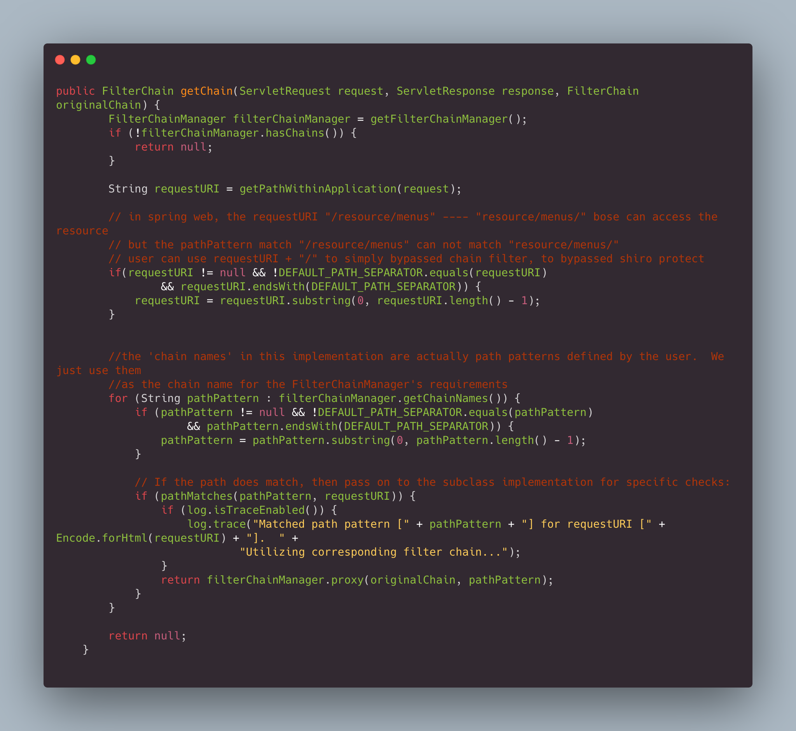
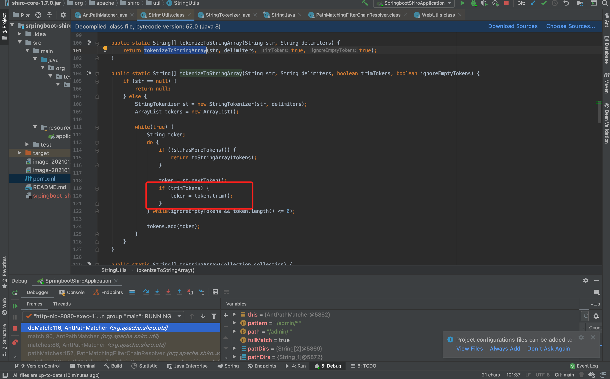
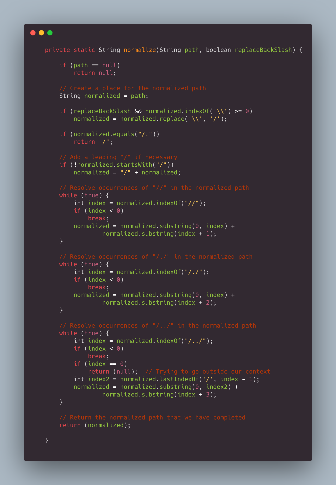
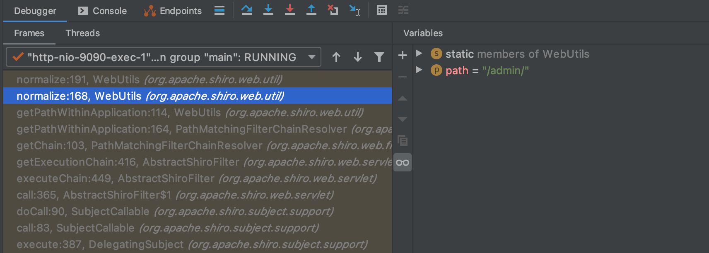

# Apache Shiro Two posture bypass authentication analysis (CVE-2020-17523)

## 0x01 Vulnerability description

Apache Shiro is a powerful and easy-to-use Java security framework that performs authentication, authorization, password and session management. Using Shiro's easy-to-understand API, you can quickly and easily get any application, from the smallest mobile application to the largest web and enterprise application.

When it is used in combination with Spring, under certain permission matching rules, an attacker can complete identity authentication bypass by constructing a special HTTP request packet.

Scope of influence: Apache Shiro <1.7.1

## 0x02 Vulnerability environment construction

shiro 1.7.0

https://github.com/jweny/shiro-cve-2020-17523 The vulnerability environment of both poses has been updated.
## 0x03 poc test

**Position 1:**

http://127.0.0.1:8080/admin/%20 or http://127.0.0.1:8080/admin/%20/

Use blank characters such as spaces to bypass shiro authentication.


**Position 2:**

After communicating with master p0desta, I found that there is another way to use it in special scenarios.

http://127.0.0.1:8080/admin/%2e or http://127.0.0.1:8080/admin/%2e/

But `.` (and `/`) represent the path separator in Spring's path matching rules, and are not matched as ordinary characters. Therefore, accessing `/admin/.` under default conditions will return 404.

But in the scenario where the full path is turned on, `setAlwaysUseFullPath(true)` can be matched normally.


## 0x04 Vulnerability analysis

The URL acquisition and matching in Shiro is in `org.apache.shiro.web.filter.mgt.PathMatchingFilterChainResolver#getChain`

Let's briefly look at this `getChain` method:




This method first checks whether the requestURI ends with `/`, and if so, deletes the last `/`.

Then in the loop of matching paths, it will first determine whether the path pattern pathPattern ends with `/`, and delete it if it is. Then call the `pathMatches()` method for path matching.

**Therefore, it does not matter whether it ends with `/` in the two ways of use, because it will be deleted after the first pass through the `getChain` method. **

### 4.1 Space bypass analysis

Pay attention to the `pathMatches()` method:

Call up Evaluate, calculate the `pathMatches("/admin/*","/admin/1")` and `pathMatches("/admin/*","/admin/ ")` respectively, the former matches normally, the latter The match failed.


Start debugging, debugging will start after a long F7. Until `doMatch("/admin/*","/admin/ ")`. It can be seen that the pathDirs returned by `tokenizeToStringArray` has no second-level path. Therefore, `/admin/*` and `/admin` will not match.


Follow the `tokenizeToStringArray` method and find that the `trimTokens` parameter when calling the `tokenizeToStringArray` method is true.


In the `tokenizeToStringArray` method, when the parameter `trimTokens` is true, it will be processed by `trim()`, so the spaces are cleared. When returning to `getChain` again, the last `/` is deleted. Therefore, the pathDirs returned by `tokenizeToStringArray` has no second-level path.



To sum it up: In the vulnerable shiro version, when the `tokenizeToStringArray` method is called, the `trimTokens` parameter defaults to true, and spaces will be processed by `trim()`, thus causing the spaces to be cleared. When returning to `getChain` again, the last `/` is deleted, so the match between `/admin` and `/admin/*` fails, which leads to authentication bypass. The access path received by Spring is `/admin/%20`, and the response is returned according to the normal logic, which causes the permission to be bypassed.

### 4.2 /./Bypass analysis

Seeing `/.` and `/./` in the second posture, do you think of a familiar method? That's right, it is `normalize()`.


A simple translation is:

| Conditions | Examples |
| ------------------------------ | ------------------ ------ |
| Forward slashes are treated as backslashes | \ -> / |
| Double backslashes are treated as backslashes | // -> / |
| End with /. or /.., add / | /. -> /./ /.. -> /../ |
| Normalization processing /./ | /./ -> / |
| Path jump | /aaa/../bbb -> /bbb |

So `/admin/.` becomes `/admin/` after being processed as `/admin/./`.



After being processed by `org.apache.shiro.web.filter.mgt.PathMatchingFilterChainResolver#getChain`, since the end of `/`, if it is, delete the last `/` and become `/admin`. ``/admin` does not match `/admin/*`, so shiro authentication is bypassed.


At this time, the request Spring received is `/admin/.`. **If full path matching is not enabled, `.` and `/` are used as path separators in Spring and do not participate in path matching. **Therefore, the mapping will not be matched, and 404 will be returned.


If full path matching is enabled, the entire url will be matched, so Spring returns 200.

Here is the code to enable full path matching:

```
@SpringBootApplication
public class SpringbootShiroApplication extends SpringBootServletInitializer implements BeanPostProcessor {

    @Override
    protected SpringApplicationBuilder configure(SpringApplicationBuilder builder) {
        return builder.sources(SpringbootShiroApplication.class);
    }

    public static void main(String[] args) {

        SpringApplication.run(SpringbootShiroApplication.class, args);
    }

    @Override
    public Object postProcessBeforeInitialization(Object bean, String beanName)
            throws BeansException {
        if (bean instanceof RequestMappingHandlerMapping) {
            ((RequestMappingHandlerMapping) bean).setAlwaysUseFullPath(true);
        }
        return bean;
    }

    @Override
    public Object postProcessAfterInitialization(Object bean, String beanName)
            throws BeansException {
        return bean;
    }
}
```


## 0x05 Official repair plan

After the above analysis, there are two reasons for shiro permission bypass:

1. The `tokenizeToStringArray` function does not handle spaces properly.
2. The logic of processing the last `/` should not be before the logic of the loop matching path.

Therefore, the official repair plan is:

https://github.com/apache/shiro/commit/0842c27fa72d0da5de0c5723a66d402fe20903df

1. Set the `trimTokens` parameter of `tokenizeToStringArray` to false. 
2. Adjust the logic to delete the last `/`. Modified to match the original path first, and then go to delete the last `/` logic after the match fails. 

## 0x06 About trim

In principle, `trim()` will clear all whitespaces before and after the string. Spaces are only one of them. However, other whitespaces other than spaces were found in the test, such as `%08`, `%09`, `%0a `, spring+tomcat will return 400 during processing.

Therefore, in addition to spaces, no other useful payload has been found in the first gesture.

## 0x07 Reference

https://github.com/apache/shiro/commit/0842c27fa72d0da5de0c5723a66d402fe20903df

https://www.anquanke.com/post/id/216096

https://www.cnblogs.com/syp172654682/p/9257282.html


