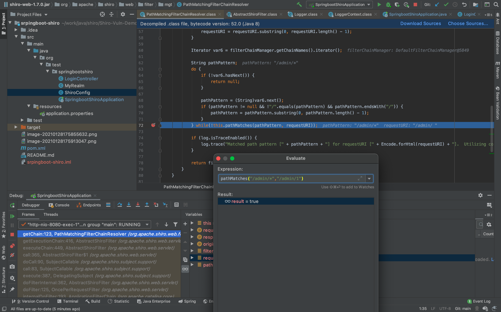
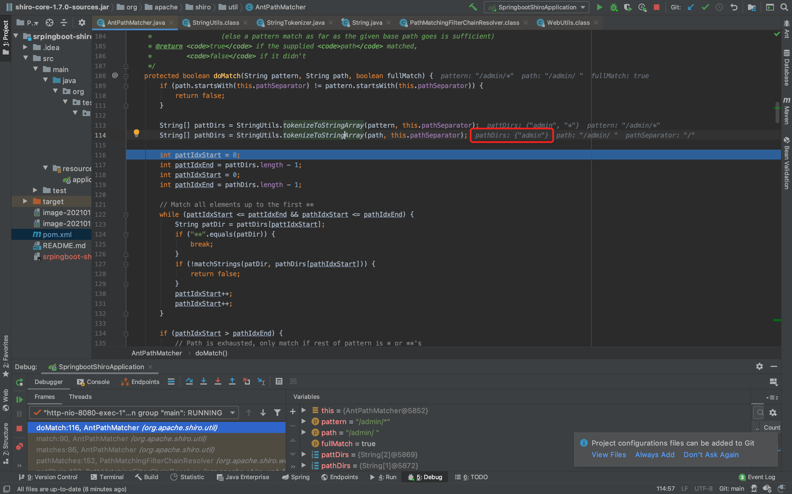
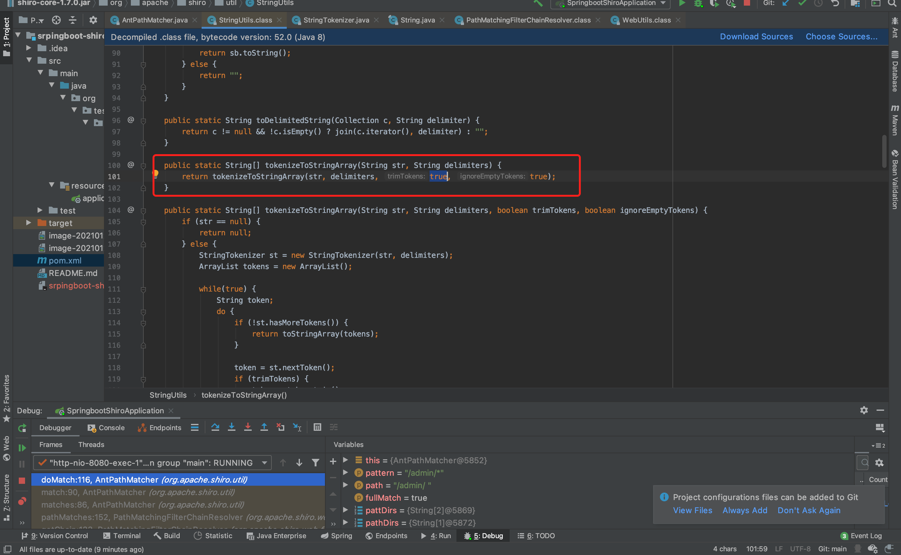

# Apache Shiro 认证绕过分析（CVE-2020-17523）

https://www.anquanke.com/post/id/230935

## 0x01 漏洞描述

Apache Shiro是一个强大且易用的Java安全框架，执行身份验证、授权、密码和会话管理。使用Shiro的易于理解的API，您可以快速、轻松地获得任何应用程序，从最小的移动应用程序到最大的网络和企业应用程序。

当它和 Spring 结合使用时，在一定权限匹配规则下，攻击者可通过构造特殊的 HTTP 请求包完成身份认证绕过。

影响范围：Apache Shiro < 1.7.1

## 0x02 漏洞环境搭建

shiro 1.7.0

https://github.com/jweny/shiro-cve-2020-17523

## 0x03 poc测试

http://127.0.0.1:8080/admin/%20  

使用空格等空字符，可绕过shiro身份验证。


## 0x04 漏洞分析

漏洞环境中，`/admin/*`所匹配的url都应在shiro的鉴权范围内。shiro校验path的函数为pathMatches。pathMatches返回true时，匹配命中的url才会进入后续的鉴权逻辑。

在org.apache.shiro.util.AntPathMatcher#doMatch方法的pathMatches处下断点。

**先手工验证下漏洞产生原因：**

调出Evaluate，计算一下```pathMatches（"/admin/*","/admin/1"）```，正常匹配，返回true。



计算一下pathMatch（"/admin/*","/admin/ "），正常失败了，返回false，不会鉴权，但是spring接受到的是url是`/admin/%20`，返回正产页面admin page。


**开始跟随调试：**

调试开始会经过一阵无聊的F7。一直到```doMatch("/admin/*","/admin/ ")```。

可见，`tokenizeToStringArray`返回的pathDirs已经没有空格了。因此会导致`/admin/* `和`/admin/ `不匹配。



这里简单说一下为什么不是shiro的匹配函数`matchStrings()`的问题。`matchStrings()`在匹配`*`时，只要要匹配的字符串不是空，均返回匹配成功。因此只有空格被删的情况下，才会出现与`*`匹配失败。


可见是`tokenizeToStringArray`造成的。跟一下`tokenizeToStringArray`方法，发现其调用`tokenizeToStringArray`方法时的`trimTokens`参数为true。



而`tokenizeToStringArray`方法，在参数`trimTokens`为true时，会经过`trim()`处理，因此导致空格等空白字符被清除。


总结一下：存在漏洞的shiro版本，由于调用`tokenizeToStringArray`方法时，`trimTokens`参数默认为true，导致空格等空白字符被删，因此无法与pattern`*`匹配，导致该路径无法经过鉴权。但是spring接受到的访问路径为`/admin/%20`，按照正常逻辑返回响应，因此导致权限被绕过。

## 0x05 官方的修复方案

经过以上的分析，修复方案已经很明确了，将`trimTokens`设置为false。


## 0x06关于trim

原理上来说`trim()`会清空字符串前后所有的whitespace，空格只是其中的一种，但是在测试中发现除了空格以外的其他whitespace，例如`%08`、`%09`、`%0a`，spring处理时都会返回400。

因此除了空格，尚未发现其他好用的payload。